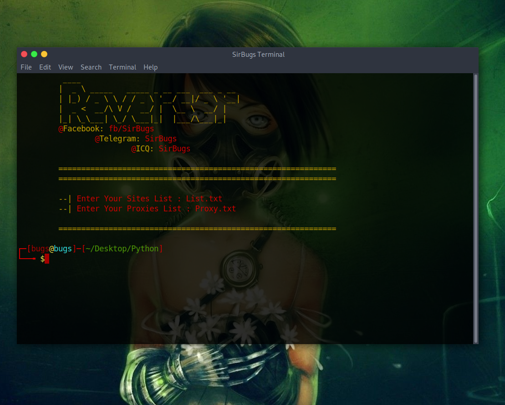

# Reverser

Auto Domain Names Reverser

```
  ____                                   
 |  _ \ _____   _____ _ __ ___  ___ _ __ 
 | |_) / _ \ \ / / _ \ '__/ __|/ _ \ '__|
 |  _ <  __/\ V /  __/ |  \__ \  __/ |   
 |_| \_\___| \_/ \___|_|  |___/\___|_|   
 @Facebook: fb/SirBugs
      @Telegram: SirBugs
            @ICQ: SirBugs
```

```bash
$ pip install requests
$ pip install colorama
```
```bash
$ python Stripe.py
```




# How to use
- Requirements
  - Fast internet connection
  - Path list exmapledomain.com
  - requests, colorama modules

### The domains Entering:
- Enter the domain name only
  - domain.com [✔️]
  - https://domain.com/ [❌]

# FAQ
[❓]: Which python version do i need?     
[A]:  Python 2.7  

[❓]: Im not getting any Results?     
[A]:  Check Your Internet Connection

# Come Out & Updates
**20/09/2020:** First come out of the script V1.0. 😃

# Contacting
**Facebook:** https://facebook.com/SIRBUGS  :point_left:  
Made with ❤️ in Egypt

Coded By SIRBUGS ❤️
